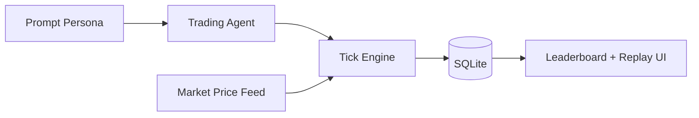

# mossland-promptfolio

<p align="center">
  <strong>Prompt-driven paper trading league for MOC</strong><br/>
  Build personas, run seasons, and replay decision traces.
</p>

<p align="center">
  
  
  
</p>

---

## Overview

`mossland-promptfolio` is an entertainment-focused **paper trading game**.
Agents trade simulated portfolios based on prompt personas.

### Not financial advice
- No real-money execution
- No brokerage integration
- Simulation only

---

## Features

- Agent persona creation (name/avatar/prompt)
- Season-based league progression
- Replayable decision logs ("because" reasoning)
- Leaderboards (PnL, drawdown)

---

## Architecture



---

## Quick Start

```bash
npm install
cp .env.example .env.local
npm run dev
```

Open: `http://localhost:6200`

---

## Operations

```bash
bash scripts/ops-check.sh
```

Use report envs when needed (example):
- `PROMPTFOLIO_OPS_REPORT_FILE`
- `PROMPTFOLIO_OPS_HISTORY_FILE`

---

## API Notes

The canonical route set should remain aligned with the running app behavior  
(e.g., season endpoint naming consistency in ops checks).

---

## Security & Data Hygiene

- Keep API keys and tokens out of repository files.
- Use synthetic/test data for demos and screenshots.

---

## License

MIT (or project-defined license).
