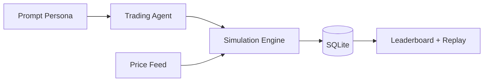

# mossland-promptfolio

> **Prompt-persona paper trading league for experimentation, replayability, and explainable strategy behavior.**


## ◼ Background

Many "AI trading" projects over-index on prediction claims and under-invest in explainability.  
Promptfolio was designed as an explicit simulation-first sandbox:

- no real-money execution,
- no hidden custody mechanics,
- no pseudo-guarantee framing.

It is a system for strategy behavior experimentation, not financial promises.

## ◼ Mission

Enable teams to prototype, compare, and replay prompt-driven trading personas in a safe and fully simulated environment.

## ◼ Vision

Build a robust "agent strategy lab" where behavior quality can be evaluated over seasons, not single snapshots.

## ◼ Product Philosophy

- **Entertainment + experimentation first**
- **Replayability over hype metrics**
- **Explain decisions, don’t just score outcomes**

## ◼ Core Features

| Feature | Description |
|---|---|
| Persona setup | Agent identity built from prompt, name, avatar |
| Season loop | Time-bounded competitive progression |
| Replay trail | Reason-attached trade history |
| Leaderboard | Outcome metrics (PnL, drawdown, consistency) |
| Ops checks | Deployment-aligned runtime verification |

## ◼ Architecture Snapshot



## ◼ Tech Stack

- Next.js (App Router)
- Node.js runtime
- SQLite local persistence
- CoinGecko feed integration (simulation context)

## ◼ Quick Start

```bash
npm install
cp .env.example .env.local
npm run dev
```

Open `http://localhost:6200`

## ◼ Operations

```bash
bash scripts/ops-check.sh
```

## ◼ Disclaimer

This project is a **paper trading game** and strategy sandbox.  
Nothing here is financial advice.

## ◼ License

MIT (or project-defined license)
