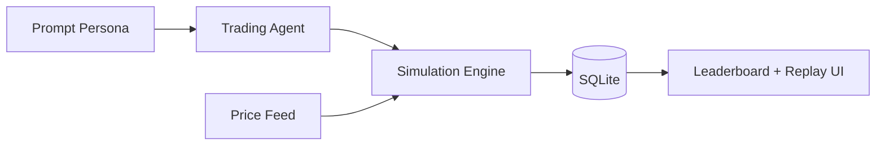

# mossland-promptfolio

<p align="center">
  
</p>

<p align="center">
  <strong>Prompt-persona paper trading league for simulation-first experimentation.</strong>
</p>

<p align="center">
  
  
  
</p>

## Overview

Promptfolio is a simulation league where personas drive autonomous strategy behavior.

This is intentionally **not** a brokerage product:

- no real-money execution
- no custody path
- no financial advice surface

## Product goals

- Make strategy behavior observable and replayable
- Reward consistency over hype via season structure
- Keep setup lightweight for rapid experimentation

## Core capabilities

- Persona + prompt based agent setup
- Season progression and ranking loop
- Decision replay and reason traces
- Ops checks aligned with active route contracts

## Architecture



## Quickstart

```bash
npm install
cp .env.example .env.local
npm run dev
```

Open: <http://localhost:6200>

## Operations

```bash
bash scripts/ops-check.sh
```

## Engineering notes

- Keep API route naming and ops checks in lockstep to prevent false 404 alarms.
- Treat historical permission errors as signals for startup preflight hardening.
- Prefer explicit schema fields for replay output evolution.

## Security

- Keep provider keys out of repository and screenshots.
- Use synthetic/example data for docs and demos.

## License

MIT (or project-defined license)
