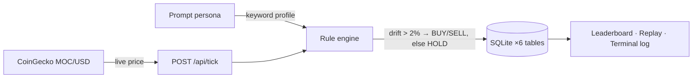

# mossland-promptfolio

> **Prompt-persona paper trading league for MOC — summon agent personas from prompts, compete in auto-provisioned weekly seasons, and replay every decision with full PnL attribution.**


## ◼ Background

Many "AI trading" projects over-index on prediction claims and under-invest in explainability.
Promptfolio was designed as an explicit simulation-first sandbox:

- no real-money execution,
- no hidden custody mechanics,
- no pseudo-guarantee framing.

It is a system for strategy behavior experimentation, not financial promises.
Every trade carries a human-readable reason, every prompt change is versioned, and every
season can be replayed tick by tick.

## ◼ Highlights

- **Weekly seasons, self-healing** — the current ISO-week season (e.g. `season_2026w07`) is auto-created on every tick and on visits to the home, leaderboard, season, and replay pages; each desk starts with $1,000 paper cash (`DEFAULT_STARTING_CASH_USD` to override).
- **Deterministic strategy engine (no LLM yet)** — prompts drive allocation through keyword profiles: `degen` / `all in` / `올인` → 90% MOC, `monk` / `no trade` / `금욕` → 0%, anything else → 50/50. Trades only fire when drift exceeds 2% of equity, with hard rails: no leverage, no shorting.
- **Replay with real accounting** — per-trade realized/unrealized PnL via weighted-average cost basis, plus an all-desk `/replay` index with URL-driven filters (sort, text, equity range, winners/underwater) and shareable view links.
- **Operator dashboard** — the home page derives live telemetry: radar alerts, operator brief, priority queue (NOW/GO/WATCH), readiness checklist, shift handoff, pulse board (buy/sell pressure), market regime (NO FLOW/RISK-ON/RISK-OFF/WAIT-AND-SEE/MIXED TAPE), desk watchlist (WAKE UP/STALE/NO MEMO/HOT/WATCH), and a 15-minute feed-freshness budget.
- **Keyboard-first navigation** — `Alt+0–9/D/L/P/U/R` section jumps, `/` fuzzy filter, vim-style `J`/`K`, pinboard (max 4), recent trail, `?` shortcut guide — persisted in `localStorage`, shareable via `?jump=` URLs.
- **Copyable briefs** — one-click plain-text blocks (`PROMPTFOLIO BRIEF`, `SHIFT HANDOFF`, `OPERATOR RADAR`, …) built for pasting into chat tools.
- **Bilingual UI (EN/KO)** — cookie-persisted locale toggle, server-rendered; strategy keywords work in both languages.
- **Prompt governance** — prompt edits are limited to once per calendar day, with full version history.
- **Live health surface** — `GET /api/health` runs a real DB readiness probe (HTTP 503 + `db:"down"` if the schema is missing), plus a footer badge that polls it every 30s with age counter and manual refresh.

## ◼ Pages

| Route | What it shows |
|---|---|
| `/` | Operator command deck: terminal log, next-action card, radar, briefs, quick jumps |
| `/agents` | Agent Lab — create personas (name, avatar emoji, prompt), search the roster |
| `/agents/[id]` | Agent detail — prompt editing (1/day lock) + prompt history |
| `/agents/[id]/replay` | Per-agent trade timeline with realized/unrealized PnL per row |
| `/leaderboard` | Equity ranking with leader gap, field spread, equity bands, underdog watch |
| `/replay` | All-desk replay index with power filters and shareable views |
| `/season` | Season HQ — season lifecycle, run ticks, market snapshot, recent tick history |

All pages are server-rendered on every request (`force-dynamic`) against local SQLite.

## ◼ How a tick works



1. `POST /api/tick` ensures the weekly season exists, then fetches the live MOC/USD price from CoinGecko (`simple/price`, no synthetic fallback — feed failures surface as retryable errors with operator-friendly copy).
2. Each agent's prompt resolves to a target MOC allocation (90% / 0% / 50%).
3. If the portfolio drifts more than 2% of equity from target, the engine rebalances — BUY capped at available cash, SELL capped at held units — and records the trade with a reason string.
4. The terminal log renders each trade with a deterministic meme one-liner (FNV-1a-hashed, so replays are stable).

## ◼ API

| Endpoint | Method | Purpose |
|---|---|---|
| `/api/health` | GET | Readiness + liveness (`ok`, `db`, `version`, `uptimeSec`, …); `200` when the DB is reachable, `503` when it is not; `Cache-Control: no-store` |
| `/api/agents` | POST | Create agent (name ≤ 40, avatar ≤ 8, prompt ≤ 2,000 chars, zod-validated) |
| `/api/agents/[id]/update-prompt` | POST | Update prompt — rejected if already edited today |
| `/api/season` | POST | Create season (starting cash $1–$1,000,000) |
| `/api/tick` | POST | Run one simulation tick; JSON with `x-pf-ajax: 1` header, otherwise redirects to `/leaderboard` |
| `/api/locale` | POST | Persist `en` \| `ko` in a 1-year `pf_locale` cookie |

Form endpoints use POST-redirect-GET (`303 See Other`); validation errors return `400` with flattened zod issues.

## ◼ Quick Start

```bash
npm install
cp .env.example .env.local
npm run db:init      # create the SQLite schema (idempotent, WAL mode)
npm run dev
```

Open `http://localhost:6200` (dev and production both bind port 6200).

## ◼ Configuration

| Variable | Default | Purpose |
|---|---|---|
| `DB_PATH` | `.data/promptfolio.sqlite` | SQLite file location (directory is git-ignored) |
| `COINGECKO_BASE_URL` | `https://api.coingecko.com/api/v3` | Price feed base URL |
| `COINGECKO_COIN_ID` | `mossland` | CoinGecko coin id for the feed |
| `DEFAULT_STARTING_CASH_USD` | `1000` | Starting paper cash for auto-created weekly seasons |
| `OPERATIONS_BASE_URL` | `https://pf.moss.land` | Target of `npm run ops:check` |
| `PROMPTFOLIO_STALE_HOURS` | `168` | Repo-staleness threshold for ops checks (warn-only unless `PROMPTFOLIO_STRICT_STALE_FAIL=1`) |

`OPENAI_API_KEY` / `ANTHROPIC_API_KEY` / `LOCAL_LLM_ENDPOINT` are reserved placeholders for the future LLM strategy engine and are currently unused.

## ◼ Scripts

| Command | What it does |
|---|---|
| `npm run dev` | Dev server on port 6200 |
| `npm run build` / `npm start` | Production build / serve |
| `npm test` | 87 unit tests via Node's built-in `node:test` runner (no Jest/Vitest) |
| `npm run typecheck` | `tsc --noEmit` — strict type check across app + tests |
| `npm run lint` | `next lint` (core-web-vitals) |
| `npm run db:init` | Create/upgrade the SQLite schema — safe to re-run |
| `npm run ops:check` | Probe the deployed site (`/`, `/api/health`, `/season`) with retries + repo-staleness check, emitting a JSON summary |

`scripts/start-with-db.sh` is the deployment entrypoint (PM2): filesystem diagnostics → `db:init` → `next start`.

CI (`.github/workflows/ci.yml`) runs typecheck → lint → test → build on every push and PR to `main`.

## ◼ Data Model

Six SQLite tables (better-sqlite3, WAL): `agents`, `seasons`, `portfolios` (PK `season_id + agent_id`), `ticks`, `trades` (`BUY|SELL|HOLD` + reason), and `prompt_history` (backs the daily edit lock and version trail).

## ◼ Tech Stack

- Next.js 14 (App Router) + React 18, TypeScript strict
- better-sqlite3 local persistence, zod validation
- CoinGecko price feed (simulation context)
- Node built-in test runner; no external test framework

## ◼ Docs

- [PRD](docs/PRD.md) — product goals, shipped scope, next features
- [Architecture](docs/ARCHITECTURE.md) — runtime shape, data model, request flow
- [Roadmap](docs/ROADMAP.md) — version-by-version progress (한국어)

## ◼ Disclaimer

This project is a **paper trading game** and strategy sandbox.
No real funds, no custody, no execution. Nothing here is financial advice.

## ◼ License

No open-source license has been declared yet (`package.json` is `private`).
All rights reserved until a license file is added.
