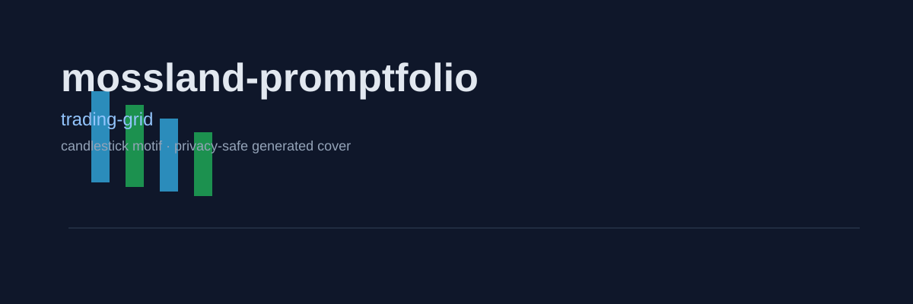
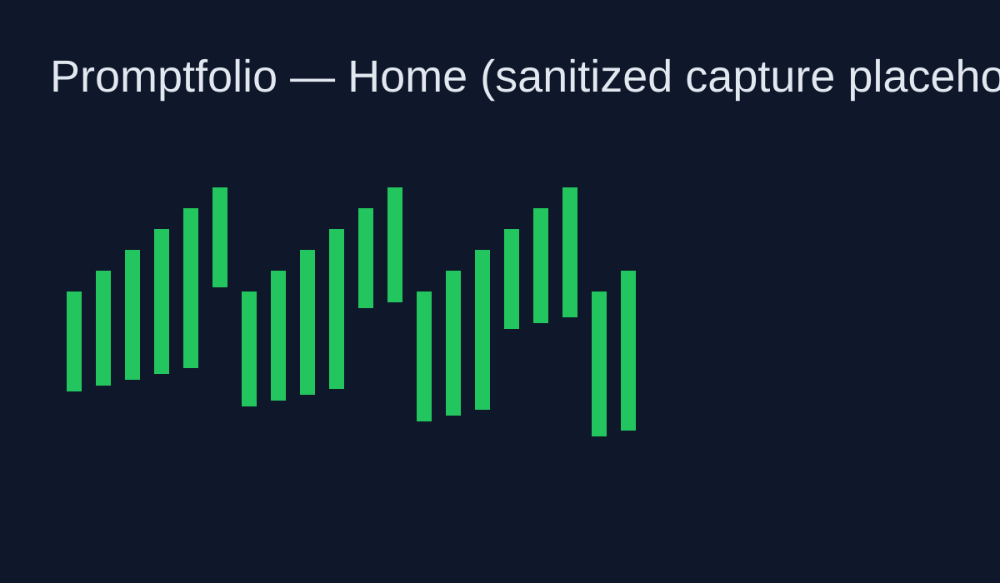

# mossland-promptfolio

Prompt-powered paper trading league for MOC.

<p align="center"></p>

## Concept

Create a persona prompt, run simulation trades, and replay each decision path.

## Feature Flavor

- Persona-first setup
- Season-based progression
- Replay-oriented explanation UX
- Ops-check friendly deployment loop

## Screenshots

> Sanitized, privacy-safe placeholder in this commit.



## Run Locally

```bash
npm install
cp .env.example .env.local
npm run dev
```

Open <http://localhost:6200>

## Operations

```bash
bash scripts/ops-check.sh
```

## License

MIT (or project-defined license)
